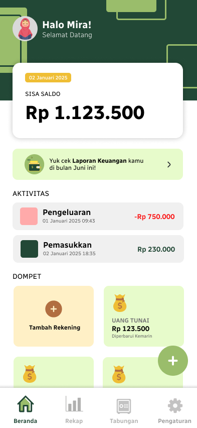

# Keuanganku 💰

🚀 **Aplikasi Keuangan Pribadi**

**Keuanganku** adalah aplikasi pencatatan keuangan yang membantu kamu mengelola pemasukan, pengeluaran, dan tabungan dengan mudah dan efisien. Dengan tampilan yang simpel dan fitur yang lengkap, Keuanganku siap membantu kamu mencapai kebebasan finansial! 💸

## 📌 Fitur Utama

✅ **Pencatatan Pemasukan** - Catat semua sumber pendapatan dengan mudah.\
✅ **Pencatatan Pengeluaran** - Kelola pengeluaran harian agar tetap terkontrol.\
✅ **Manajemen Tabungan** - Pantau perkembangan tabungan dan target finansial kamu.

🔜 **Fitur Coming Soon**
✨ **Anggaran Dana** - Bantu kamu mengalokasikan dana sesuai kebutuhan agar keuangan lebih terencana.

## 📷 Tampilan Beranda

## 🎨 Desain Figma &#x20;

- [Desain Figma]([https://www.figma.com/your-figma-link](https://www.figma.com/proto/W0FW474a1DD5840CVwGaZn/KeuanganKu?node-id=2-6&starting-point-node-id=2%3A6))

💡 **Keuanganku - Bantu Kelola Keuanganmu dengan Lebih Baik!**

